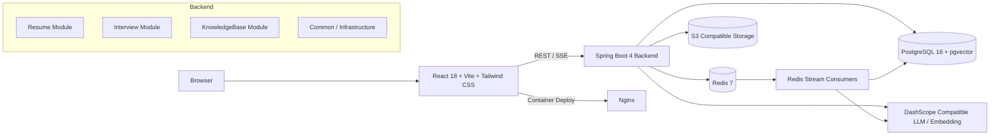

# AI Interview Platform

<div align="center">

让简历诊断、模拟面试、知识库问答，收敛成一套真正能跑起来的 AI 求职工作台。

<p>
  
  
  
  
  
  
</p>

</div>

## 项目简介

`AI Interview Platform` 是一个面向求职场景的全栈 AI 应用，围绕三条主线展开：

- 简历上传与智能分析
- 基于简历生成模拟面试并给出评估报告
- 基于自建知识库的 RAG 问答与多轮聊天

它不是把几个大模型接口简单拼起来，而是把文档解析、对象存储、异步任务、向量检索、流式输出、会话缓存和 PDF 导出串成了一条完整链路。结果就是：你可以从上传简历开始，一路走到面试评估与知识沉淀，整个过程在同一套系统里闭环。

---

## 核心能力

| 能力 | 用户能得到什么 | 当前实现方式 |
| --- | --- | --- |
| 简历分析 | 上传 PDF / DOCX / TXT / MD 后自动获得评分、摘要、亮点与改进建议 | Apache Tika 解析文档，S3 兼容对象存储保存原文件，Redis Stream 异步触发 AI 分析，结果支持 PDF 导出 |
| 模拟面试 | 基于简历内容生成题目，逐题作答，生成完整面试报告 | Spring AI 生成问题，Redis 缓存会话状态，异步评估答案并持久化历史 |
| 知识库问答 | 上传资料后构建私有知识库，支持多知识库联合检索和流式回答 | PostgreSQL + pgvector 存储向量，Spring AI 做 RAG 检索增强，SSE 输出实时答案 |
| 多轮聊天 | 围绕知识库持续追问、保留会话上下文 | 独立 RAG Chat Session，消息落库，流式响应完成后回填消息内容 |
| 系统韧性 | 长耗时 AI 任务不阻塞主线程，热点接口具备限流与重试能力 | Java 21 虚拟线程、Redis Stream、Lua 限流脚本、结构化输出重试机制 |

---

## 架构总览



### 分层设计

后端代码位于 `app/src/main/java/interview/guide`，采用比较清晰的分层：

- `common`
  - 统一结果封装、异常体系、限流注解与切面、异步 Stream 抽象、AI 结构化输出封装
- `infrastructure`
  - 文档解析、文件存储、Redis 能力封装、PDF 导出、MapStruct 映射器
- `modules/resume`
  - 简历上传、去重、解析、分析历史、重新分析、PDF 导出
- `modules/interview`
  - 面试问题生成、会话管理、答案提交、评估报告、面试历史
- `modules/knowledgebase`
  - 知识库上传、向量化、RAG 查询、知识库管理、多轮聊天会话

前端位于 `frontend/`，使用 `React + React Router + Axios + Tailwind CSS + Framer Motion + Recharts`，把功能拆成页面、组件、API 层和类型定义四块，便于快速迭代。


## 前端界面与交互

前端不是一个单页表单，而是一套围绕求职流程设计的工作台：

- 上传简历页
  - 上传后自动进入简历库查看分析状态
- 简历库与详情页
  - 查看历史分析、评分雷达图、改进建议、导出报告
- 模拟面试页
  - 逐题答题、自动保存、面试完成后查看记录
- 知识库管理页
  - 上传、分类、删除、重试向量化、统计数据
- 问答助手页
  - 面向多个知识库的流式 RAG 聊天

同时，前端还做了这些工程细节：

- React Router 路由拆分与懒加载
- Vite `manualChunks` 做基础 vendor 拆包
- Axios 统一解包后端 `Result<T>` 响应结构
- Tailwind + Framer Motion 负责界面与动效
- Recharts 负责雷达图和分数可视化

---

## 项目结构

```text
interview-guide/
├─ app/                        # Spring Boot 后端
│  ├─ src/main/java/interview/guide
│  │  ├─ common/               # 通用能力：异常、限流、异步、AI封装、配置
│  │  ├─ infrastructure/       # 文件、存储、Redis、导出、Mapper
│  │  └─ modules/
│  │     ├─ resume/            # 简历分析模块
│  │     ├─ interview/         # 模拟面试模块
│  │     └─ knowledgebase/     # 知识库/RAG模块
│  ├─ src/main/resources/      # application.yml、prompt、Lua 脚本、字体
│  └─ src/test/java/           # JUnit 5 测试
├─ frontend/                   # Vite + React 前端
│  ├─ src/api/                 # API 请求封装
│  ├─ src/components/          # 可复用组件
│  ├─ src/pages/               # 页面级组件
│  ├─ src/types/               # 类型定义
│  └─ src/utils/               # 工具函数
├─ docker/                     # 初始化脚本
├─ docker-compose.yml          # 一体化本地部署
└─ .env.example                # 环境变量模板
```

---

## 技术栈

### 后端

- Java 21
- Spring Boot 4
- Spring AI 2.0
- Spring Data JPA
- PostgreSQL 16
- pgvector
- Redisson / Redis Stream
- Apache Tika
- AWS S3 SDK
- MapStruct
- iText 8

### 前端

- React 18
- Vite 5
- TypeScript 5
- Tailwind CSS 4
- React Router
- Axios
- Framer Motion
- Recharts

### 基础设施

- Docker Compose
- Redis 7
- PostgreSQL + pgvector
- MinIO
- Nginx
- DashScope OpenAI 兼容接口

说明：代码里的存储层按 `S3 兼容对象存储` 抽象，当前 `docker-compose` 默认使用 `MinIO`；如果切换到 RustFS 或云厂商 S3，只需要调整存储配置。

---

## 快速开始

### 环境要求

- JDK 21
- Node.js 20+
- pnpm 10+
- Docker / Docker Compose
- 可用的 `AI_BAILIAN_API_KEY`

### 方式一：一条命令启动整套系统

这是最快的体验方式。

#### 1. 准备环境变量

复制根目录的环境变量模板，并填写你的百炼 API Key：

```bash
cp .env.example .env
```

至少需要配置：

```env
AI_BAILIAN_API_KEY=your_api_key_here
AI_MODEL=qwen-plus
```

如果文本模型要切到只支持 `/v1/responses` 的供应商，额外配置：

```env
APP_AI_TEXT_PROVIDER=responses
APP_AI_RESPONSES_BASE_URL=https://api.openai.com
APP_AI_RESPONSES_PATH=/v1/responses
AI_RESPONSES_API_KEY=your_responses_api_key_here
APP_AI_RESPONSES_MODEL=gpt-5.4
```

说明：知识库 embedding 仍沿用 `AI_BAILIAN_API_KEY` 对应的 Spring AI OpenAI 兼容配置。

#### 2. 启动所有服务

```bash
docker compose up -d --build
```

#### 3. 打开系统

- 前端：http://localhost
- 后端：http://localhost:8080
- MinIO Console：http://localhost:9001
- PostgreSQL：`localhost:5432`
- Redis：`localhost:6379`

---

### 方式二：前后端分离开发

适合本地调试代码。

#### 1. 先启动基础设施

```bash
docker compose up -d postgres redis minio createbuckets
```

#### 2. 启动后端

Windows:

```powershell
.\gradlew.bat bootRun
```

macOS / Linux:

```bash
./gradlew bootRun
```

#### 3. 启动前端

```bash
cd frontend
pnpm install
pnpm dev
```

启动后访问：

- 前端开发环境：http://localhost:5173
- 后端接口：http://localhost:8080

前端开发服务器已经代理 `/api` 到后端，无需手动改请求地址。

---

## 常用命令

| 场景 | 命令 |
| --- | --- |
| 启动后端 | `.\gradlew.bat bootRun` |
| 后端测试 | `.\gradlew.bat test` |
| 安装前端依赖 | `cd frontend && pnpm install` |
| 启动前端开发环境 | `cd frontend && pnpm dev` |
| 构建前端 | `cd frontend && pnpm build` |
| 启动全套容器 | `docker compose up -d --build` |
| 关闭全套容器 | `docker compose down` |

---

## 关键配置说明

### 必填配置

| 变量名 | 说明 | 默认值 |
| --- | --- | --- |
| `AI_BAILIAN_API_KEY` | 百炼 API Key，必填 | 无 |
| `AI_MODEL` | 聊天模型名称 | `qwen-plus` |
| `APP_AI_TEXT_PROVIDER` | 文本生成供应商，`spring-ai` 或 `responses` | `spring-ai` |
| `APP_AI_RESPONSES_BASE_URL` | Responses API 根地址，例如 `https://icoe.pp.ua` | 空 |
| `APP_AI_RESPONSES_PATH` | Responses API 路径 | `/v1/responses` |
| `AI_RESPONSES_API_KEY` | Responses API Key | 空 |
| `APP_AI_RESPONSES_MODEL` | Responses 模型名称 | 跟随 `AI_MODEL` |

### 常用可选配置

| 变量名 | 说明 | 默认值 |
| --- | --- | --- |
| `POSTGRES_HOST` | PostgreSQL 地址 | `localhost` |
| `POSTGRES_PORT` | PostgreSQL 端口 | `5432` |
| `REDIS_HOST` | Redis 地址 | `localhost` |
| `REDIS_PORT` | Redis 端口 | `6379` |
| `APP_STORAGE_ENDPOINT` | 对象存储地址 | `http://localhost:9000` |
| `APP_INTERVIEW_FOLLOW_UP_COUNT` | 每题追问数量 | `1` |
| `APP_INTERVIEW_EVALUATION_BATCH_SIZE` | 评估批量大小 | `8` |

---

## 开发提示

- 当前 `app/src/main/resources/application.yml` 中 `spring.jpa.hibernate.ddl-auto` 为 `create`
  - 这适合首次启动快速建表，但如果你希望保留已有数据，建议在本地初始化完成后改为 `update`
- 文件上传大小默认上限为 `50MB`
  - 简历业务层额外限制为 `10MB`
- 知识库问答与 RAG Chat 使用 `SSE` 输出流式内容
- 后端统一采用 `Result<T>` 响应格式，前端 Axios 已做统一拆包

---

## 扩展方向

- 用户体系与多租户知识库
- 面试录音 / 语音转写
- 更细粒度的权限与审计
- 更完整的可观测性与任务监控
- 生产环境 schema 管理与 CI/CD

---

## License

本项目当前仓库包含 `LICENSE` 文件，使用前请结合实际授权条款确认。
